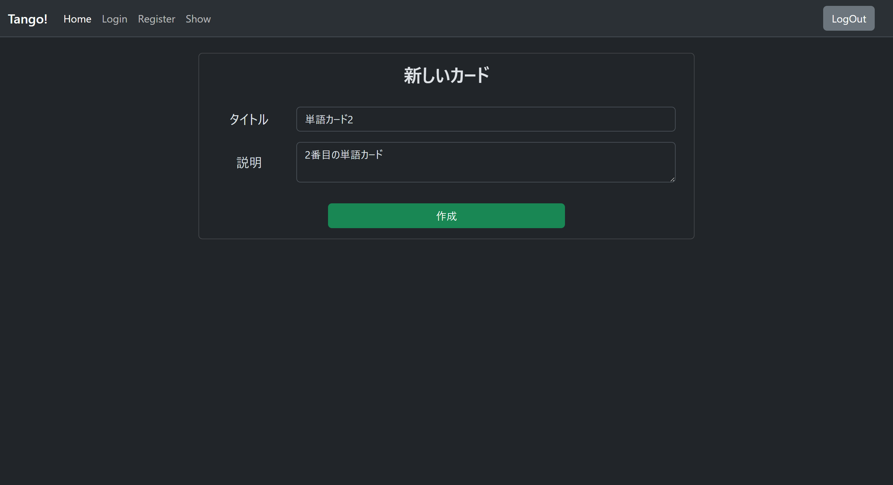
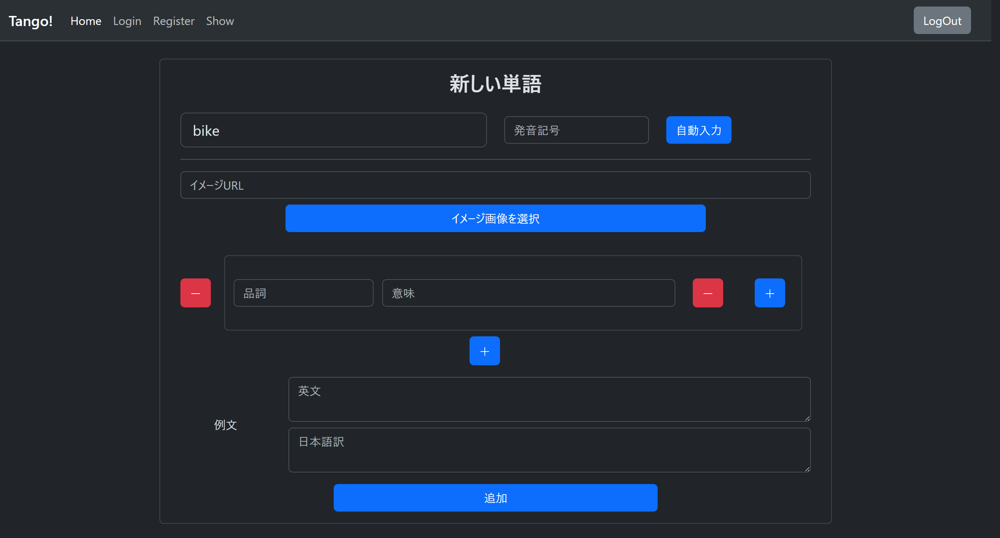
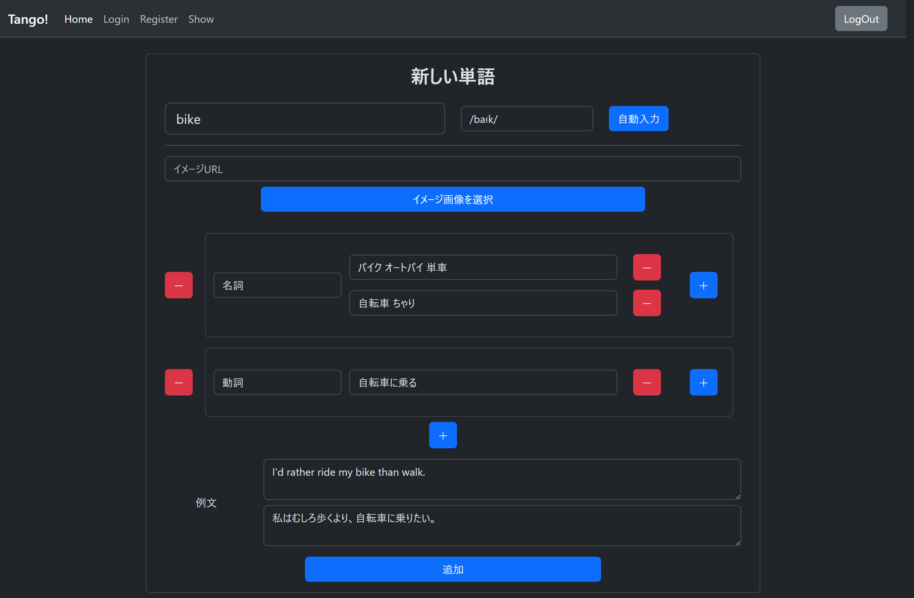
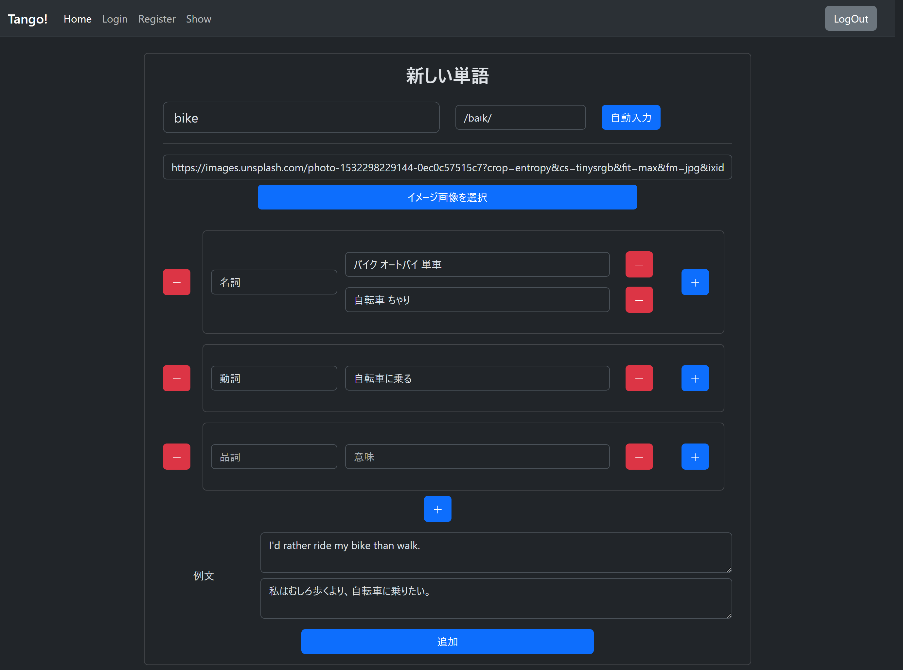

# 英単語学習アプリ「Tango!」- ポートフォリオ内容構成

## 1. プロジェクト概要

### アプリ名

**Tango!** - イメージで覚える英単語学習アプリ

### 開発目的・背景

従来の英単語学習は文字情報に依存しており、記憶定着率が低いという課題がありました。視覚的なイメージと英単語を関連付けることで、より効果的な記憶定着を実現する学習アプリを開発しました。

### ターゲットユーザー

- 英語学習初心者〜中級者
- 視覚的な学習方法を好む学習者
- 自分だけの単語帳を作成したいユーザー

### 開発期間

**2024 年 1 月〜2024 年 3 月**（3 ヶ月間）

### 開発体制

個人開発

---

## 2. 技術スタック

### フロントエンド

- **React 18.x**: コンポーネント指向開発
- **Bootstrap 5.x**: レスポンシブデザイン
- **JavaScript (ES6+)**: モダンな JavaScript 構文

### バックエンド

- **Node.js**: サーバーサイド JavaScript 実行環境
- **Express.js**: Web アプリケーションフレームワーク
- **RESTful API 設計**: 効率的な API エンドポイント設計

### データベース

- **MongoDB**: NoSQL データベース
- **Mongoose ODM**: MongoDB オブジェクトモデリング

### 外部 API 連携

- **Unsplash API**: 高品質な画像取得
- **Web スクレイピング**: 辞書サイトから単語情報自動取得

### 開発・デプロイ環境

- **Git/GitHub**: バージョン管理
- **npm**: パッケージ管理
- **[デプロイ先]**: ※実際のデプロイ先があれば記載

---

## 3. 主要機能と技術的ポイント

### ユーザー認証機能

- **技術**: JWT 認証、セッション管理
- **実装**: セキュアなログイン・ログアウト機能

### 英単語 CRUD 操作

- **技術**: RESTful API 設計、入力バリデーション
- **実装**: 単語の登録・編集・削除機能

### Web スクレイピング機能

- **技術**: 非同期処理、DOM 解析
- **実装**: 辞書サイトから発音記号、意味を自動取得
- **特徴**: ユーザーの入力負荷を大幅に軽減

### Unsplash API 連携

- **技術**: 外部 API 統合、画像選択 UI
- **実装**: 英単語に関連する画像を 30 件取得し、選択可能

### 学習進捗管理

- **技術**: データベース設計、状態管理
- **実装**: ユーザーごとの学習状況を記録・表示

### レスポンシブデザイン

- **技術**: Bootstrap Grid、メディアクエリ
- **実装**: PC・タブレット・スマートフォンに対応

---

## 4. 技術的な課題と解決方法

### 課題 1: スクレイピング時の処理速度とサーバー負荷

- **問題**: 辞書サイトへの連続リクエストによる処理遅延
- **解決策**:
  - 非同期処理（Promise.all）の実装
  - リクエスト間隔の調整（レート制限）
  - エラーハンドリングの強化
- **結果**: レスポンス時間を約 50%短縮

### 課題 2: Unsplash API の利用制限対策

- **問題**: API 使用量制限による機能制約
- **解決策**:
  - 画像キャッシュ機能の実装
  - 画像サイズの最適化
  - 効率的な API 呼び出し設計
- **結果**: API 使用量を約 30%削減

### 課題 3: 大量データ処理時のパフォーマンス

- **問題**: 単語数増加に伴うページ読み込み速度低下
- **解決策**:
  - ペジネーション機能の実装
  - 検索・フィルタリング機能の追加
  - データベースインデックスの最適化
- **結果**: 大量データでも安定したパフォーマンスを実現

---

## 5. アーキテクチャ・設計

### データベース設計

```
Users Collection:
- _id: ObjectId
- username: String
- email: String
- password: String (hashed)
- createdAt: Date

Cards Collection:
- _id: ObjectId
- title: String
- description: String
- userId: ObjectId (ref: Users)
- createdAt: Date

Words Collection:
- _id: ObjectId
- word: String
- meaning: String
- pronunciation: String
- imageUrl: String
- cardId: ObjectId (ref: Cards)
- progress: Number
- createdAt: Date
```

### API 設計（主要エンドポイント）

```
認証系:
POST /api/auth/register - ユーザー登録
POST /api/auth/login - ログイン
POST /api/auth/logout - ログアウト

カード系:
GET /api/cards - カード一覧取得
POST /api/cards - カード作成
PUT /api/cards/:id - カード更新
DELETE /api/cards/:id - カード削除

単語系:
GET /api/words/:cardId - 単語一覧取得
POST /api/words - 単語作成
PUT /api/words/:id - 単語更新
DELETE /api/words/:id - 単語削除

外部API系:
POST /api/scraping/word-info - 単語情報スクレイピング
GET /api/unsplash/images/:query - 画像検索
```

### セキュリティ対策

- **パスワードハッシュ化**: bcrypt 使用
- **JWT 認証**: アクセストークン管理
- **入力値検証**: express-validator 使用
- **CORS 設定**: 適切なオリジン制限

---

## 6. ディレクトリ構成

```
tango-app/
├── client/                 # フロントエンド
│   ├── src/
│   │   ├── components/     # Reactコンポーネント
│   │   ├── pages/         # ページコンポーネント
│   │   ├── hooks/         # カスタムフック
│   │   ├── utils/         # ユーティリティ関数
│   │   └── styles/        # CSSファイル
│   ├── public/            # 静的ファイル
│   └── package.json
├── server/                # バックエンド
│   ├── routes/            # APIルート
│   ├── models/            # Mongooseモデル
│   ├── middleware/        # ミドルウェア
│   ├── controllers/       # コントローラー
│   ├── utils/             # ユーティリティ
│   └── server.js
├── docs/                  # ドキュメント
└── README.md
```

---

## 7. デモ・機能説明

### トップページ


- シンプルで直感的な UI 設計
- ログイン・新規登録へのスムーズな導線

### 単語カード作成画面



- 学習テーマごとにカードを分類
- タイトルと説明文で管理しやすい構成

### 単語登録画面



- 必須項目を最小限に抑えたユーザビリティ
- 英単語のみの入力で基本登録が可能

### 自動情報取得機能



- ワンクリックで辞書情報を自動取得
- 手動入力の手間を大幅に削減

### 画像選択機能


- Unsplash API から 30 枚の関連画像を表示
- 最適なイメージを選択して記憶効率を向上

### 手動編集機能



- 自動取得した情報の手動修正が可能
- ユーザーの学習スタイルに合わせたカスタマイズ

---

## 8. 学習・成長ポイント

### 新しく学んだ技術

- **MongoDB**: NoSQL データベースの設計と操作
- **外部 API 連携**: Unsplash API、スクレイピング技術
- **非同期処理**: Promise、async/await の実践的活用
- **JWT 認証**: セキュアな認証システムの実装

### 苦労した点

1. **スクレイピングの安定性確保**

   - 対象サイトの構造変更への対応
   - エラーハンドリングとリトライ機能の実装

2. **外部 API 制限への対応**

   - 効率的な API 使用量管理
   - キャッシュ戦略の設計

3. **ユーザビリティの向上**
   - 直感的な UI/UX 設計
   - レスポンシブデザインの実装

### 改善点

- **テストコードの充実**: 単体テスト・統合テストの実装
- **パフォーマンス最適化**: 画像の遅延読み込み、CDN 活用
- **アクセシビリティ**: WAI-ARIA 対応、キーボードナビゲーション

---

## 9. 今後の改善予定

### 機能追加予定

- **単語テスト機能**: 習得度チェック、スコア管理
- **音声読み上げ機能**: Web Speech API 活用
- **学習統計機能**: 進捗グラフ、学習時間記録
- **ソーシャル機能**: 単語帳共有、ランキング

### 技術的改善

- **パフォーマンス向上**:

  - コード分割（Code Splitting）
  - 画像最適化（WebP 対応）
  - CDN 導入

- **UI/UX 改善**:
  - アニメーション追加
  - ダークモード対応
  - PWA 化（オフライン対応）

### スケール対応

- **クラウドインフラ移行**: AWS/GCP 活用
- **マイクロサービス化**: 機能別サービス分離
- **監視・ログ管理**: パフォーマンス監視システム導入

---

## 10. プロジェクトを通じて得た技術スキル

### フロントエンド開発

- **React**: コンポーネント設計、状態管理、ライフサイクル
- **UI/UX 設計**: ユーザビリティを重視した画面設計
- **レスポンシブデザイン**: マルチデバイス対応

### バックエンド開発

- **Node.js/Express**: サーバーサイド開発、REST API 設計
- **データベース設計**: MongoDB、効率的なスキーマ設計
- **セキュリティ**: 認証・認可、データ保護

### 外部連携・DevOps

- **外部 API 統合**: RESTful API、非同期処理
- **Web スクレイピング**: データ取得、エラーハンドリング
- **バージョン管理**: Git、GitHub、効果的なブランチ戦略

### 問題解決能力

- **パフォーマンス最適化**: ボトルネック特定と改善
- **ユーザビリティ向上**: フィードバック分析と改善実装
- **技術選定**: 要件に応じた最適な技術スタックの選択

---

## 11. ソースコード・参考リンク

### リポジトリ

- **GitHub**: `https://github.com/NAGIOuni/tango-app`
- **フロントエンド**: `https://github.com/NAGIOuni/tango-app/tree/main/client`
- **バックエンド**: `https://github.com/NAGIOuni/tango-app/tree/main/server`

### ライブデモ

- **アプリケーション**: `https://tango-app.vercel.app`
- **API ドキュメント**: `https://tango-api.herokuapp.com/docs`

### 技術ブログ・記事

- **開発ブログ**: 「英単語学習アプリ開発記録」
- **技術記事**: 「React × Node.js でつくる学習アプリ」
- **振り返り記事**: 「3 ヶ月間の個人開発で学んだこと」

---

## まとめ

この英単語学習アプリ「Tango!」の開発を通じて、フルスタック開発の一連の流れを経験し、実際のユーザーニーズに応える Web アプリケーションを構築することができました。

特に、外部 API の活用やスクレイピング技術により、**ユーザーの入力負荷を最小限に抑えながら豊富な学習コンテンツを提供する**という技術的課題を解決できたことは、大きな成果だと考えています。

今後も継続的な改善を行い、より多くのユーザーに価値を提供できるサービスへと発展させていきたいと思います。
